# Golang三色标记、混合写屏障GC模式图文全分析

[典藏版-Golang三色标记、混合写屏障GC模式图文全分析](https://segmentfault.com/a/1190000022030353)


> **原创声明**:未经作者允许请勿转载, 如果转载请注明出处  
> 作者:**刘丹冰Aceld**, 微信公众号同名

垃圾回收(Garbage Collection，简称GC)是编程语言中提供的自动的内存管理机制，自动释放不需要的对象，让出存储器资源，无需程序员手动执行。

 Golang中的垃圾回收主要应用三色标记法，GC过程和其他用户goroutine可并发运行，但需要一定时间的**STW(stop the world)**，STW的过程中，CPU不执行用户代码，全部用于垃圾回收，这个过程的影响很大，Golang进行了多次的迭代优化来解决这个问题。

#### 〇、内容提纲

本文将系统的详细介绍Golang中GC的全分析过程，包括垃圾回收的方式递进。  
内容包括：

-   G0 V1.3之前的标记-清除(mark and sweep)算法
-   Go V1.3之前的标记-清扫(mark and sweep)的缺点
-   Go V1.5的三色并发标记法
-   Go V1.5的三色标记为什么需要STW
-   Go V1.5的三色标记为什么需要屏障机制(“强-弱” 三色不变式、插入屏障、删除屏障 )
-   Go V1.8混合写屏障机制
-   Go V1.8混合写屏障机制的全场景分析

> 文章约近50张图文解析、4000+文字、推荐分阶段学习及消化

#### 一、Go V1.3之前的标记-清除(mark and sweep)算法

此算法主要有两个主要的步骤：

-   标记(Mark phase)
-   清除(Sweep phase)

**第一步**，暂停程序业务逻辑, 找出不可达的对象，然后做上标记。第二步，回收标记好的对象。

操作非常简单，但是有一点需要额外注意：mark and sweep算法在执行的时候，需要程序暂停！即 `STW(stop the world)`。也就是说，这段时间程序会卡在哪儿。


**第二步**, 开始标记，程序找出它所有可达的对象，并做上标记。如下图所示：  
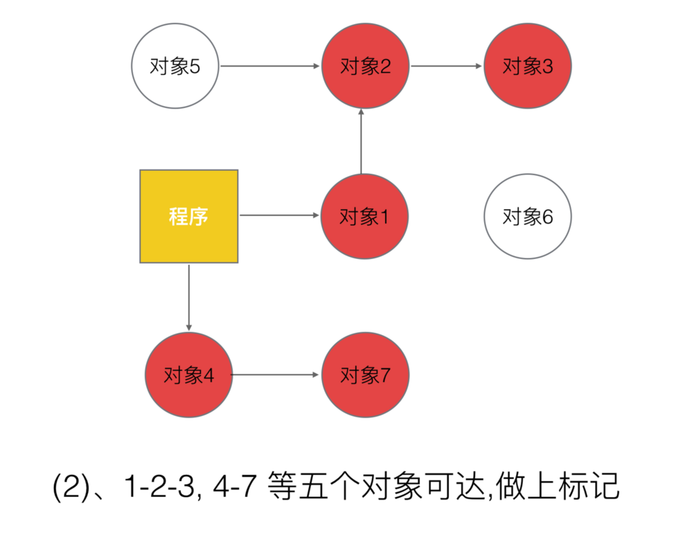

**第三步**, 标记完了之后，然后开始清除未标记的对象. 结果如下.  
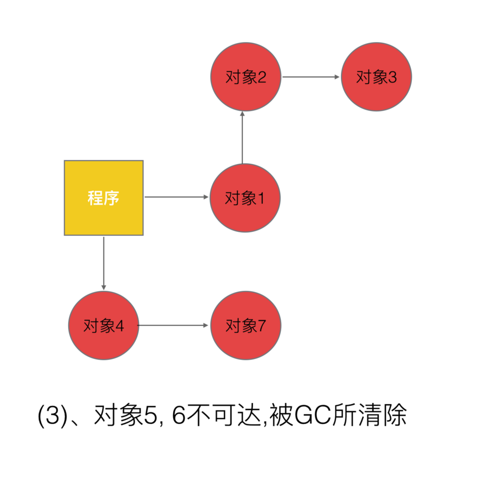  
**第四步**, 停止暂停，让程序继续跑。然后循环重复这个过程，直到process程序生命周期结束。

#### 二、标记-清扫(mark and sweep)的缺点

-   STW，stop the world；让程序暂停，程序出现卡顿 **(重要问题)**。
-   标记需要扫描整个heap
-   清除数据会产生heap碎片

所以Go V1.3版本之前就是以上来实施的, 流程是  
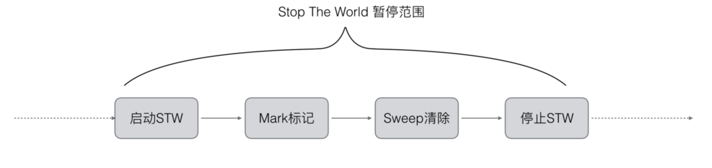

Go V1.3 做了简单的优化,将STW提前, 减少STW暂停的时间范围.如下所示

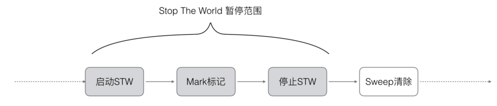

**这里面最重要的问题就是：mark-and-sweep 算法会暂停整个程序** 。

Go是如何面对并这个问题的呢？接下来G V1.5版本 就用**三色并发标记法**来优化这个问题.

#### 三、Go V1.5的三色并发标记法

三色标记法 实际上就是通过三个阶段的标记来确定清楚的对象都有哪些. 我们来看一下具体的过程.

**第一步** , 就是只要是新创建的对象,默认的颜色都是标记为“白色”.  


这里面需要注意的是, 所谓“程序”, 则是一些对象的跟节点集合.


所以上图,可以转换如下的方式来表示.

**第二步**, 每次GC回收开始, 然后从根节点开始遍历所有对象，把遍历到的对象从白色集合放入“灰色”集合。

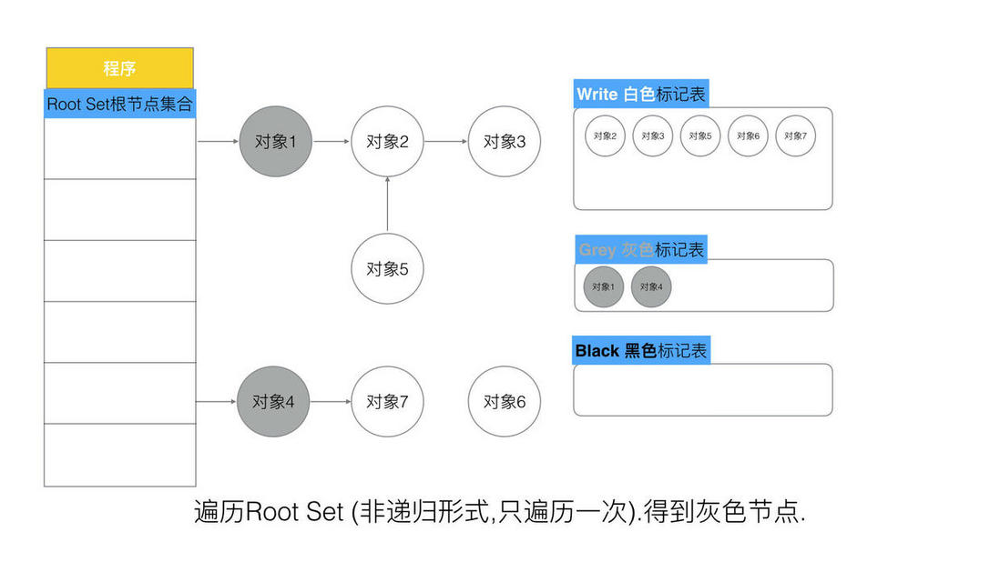

**第三步**, 遍历灰色集合，将灰色对象引用的对象从白色集合放入灰色集合，之后将此灰色对象放入黑色集合  


**第四步**, 重复**第三步**, 直到灰色中无任何对象.  
  


**第五步**: 回收所有的白色标记表的对象. 也就是回收垃圾.


以上便是`三色并发标记法`, 不难看出,我们上面已经清楚的体现`三色`的特性, 那么又是如何实现并行的呢?

> Go是如何解决标记-清除(mark and sweep)算法中的卡顿(stw，stop the world)问题的呢？

#### 四、没有STW的三色标记法

 我们还是基于上述的三色并发标记法来说, 他是一定要依赖STW的. 因为如果不暂停程序, 程序的逻辑改变对象引用关系, 这种动作如果在标记阶段做了修改，会影响标记结果的正确性。我们举一个场景.

如果三色标记法, 标记过程不使用STW将会发生什么事情?

___

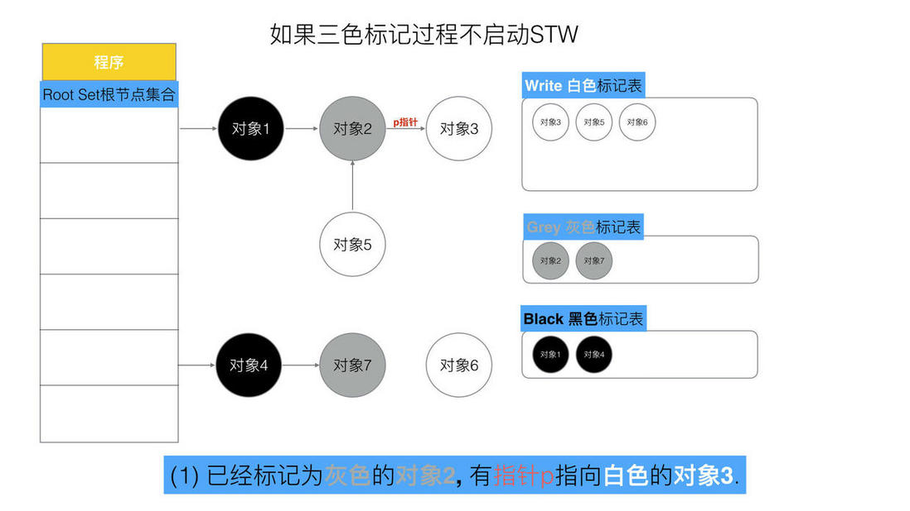

___


___


___


___


___

可以看出，有两个问题, 在三色标记法中,是不希望被发生的

-   条件1: 一个白色对象被黑色对象引用**(白色被挂在黑色下)**
-   条件2: 灰色对象与它之间的可达关系的白色对象遭到破坏**(灰色同时丢了该白色)**

当以上两个条件同时满足时, 就会出现对象丢失现象!


 当然, 如果上述中的白色对象3, 如果他还有很多下游对象的话, 也会一并都清理掉.

 为了防止这种现象的发生，最简单的方式就是STW，直接禁止掉其他用户程序对对象引用关系的干扰，但是**STW的过程有明显的资源浪费，对所有的用户程序都有很大影响**，如何能在保证对象不丢失的情况下合理的尽可能的提高GC效率，减少STW时间呢？

 答案就是, 那么我们只要使用一个机制,来破坏上面的两个条件就可以了.

#### 五、屏障机制

 我们让GC回收器,满足下面两种情况之一时,可保对象不丢失. 所以引出两种方式.

##### (1) “强-弱” 三色不变式

-   强三色不变式

不存在黑色对象引用到白色对象的指针。


-   弱三色不变式

所有被黑色对象引用的白色对象都处于灰色保护状态.


为了遵循上述的两个方式,Golang团队初步得到了如下具体的两种屏障方式“插入屏障”, “删除屏障”.

##### (2) 插入屏障

`具体操作`: 在A对象引用B对象的时候，B对象被标记为灰色。(将B挂在A下游，B必须被标记为灰色)

`满足`: **强三色不变式**. (不存在黑色对象引用白色对象的情况了， 因为白色会强制变成灰色)

伪码如下:

```
添加下游对象(当前下游对象slot, 新下游对象ptr) {   
  
  标记灰色(新下游对象ptr)   
  
  
  当前下游对象slot = 新下游对象ptr                    
}
```

场景：

```
A.添加下游对象(nil, B)   
A.添加下游对象(C, B)     
```

 这段伪码逻辑就是写屏障,. 我们知道,黑色对象的内存槽有两种位置, `栈`和`堆`. 栈空间的特点是容量小,但是要求相应速度快,因为函数调用弹出频繁使用, 所以“插入屏障”机制,在**栈空间的对象操作中不使用**. 而仅仅使用在堆空间对象的操作中.

 接下来，我们用几张图，来模拟整个一个详细的过程， 希望您能够更可观的看清晰整体流程。

___

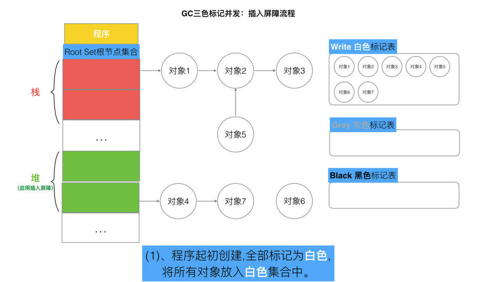

___


___

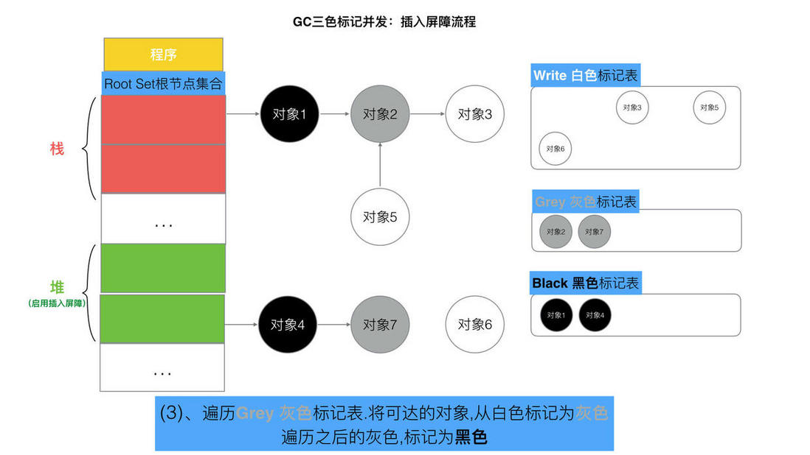

___


___

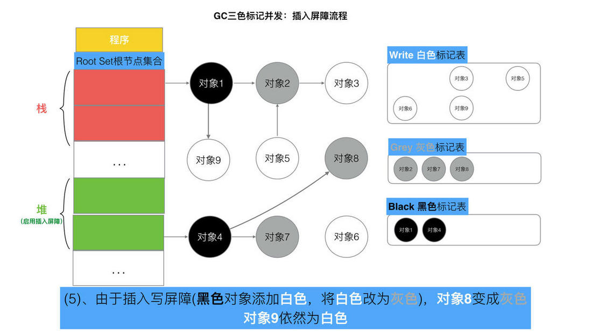

___


___

 但是如果栈不添加,当全部三色标记扫描之后,栈上有可能依然存在白色对象被引用的情况(如上图的对象9). 所以要对栈重新进行三色标记扫描, 但这次为了对象不丢失, 要对本次标记扫描启动STW暂停. 直到栈空间的三色标记结束.

___

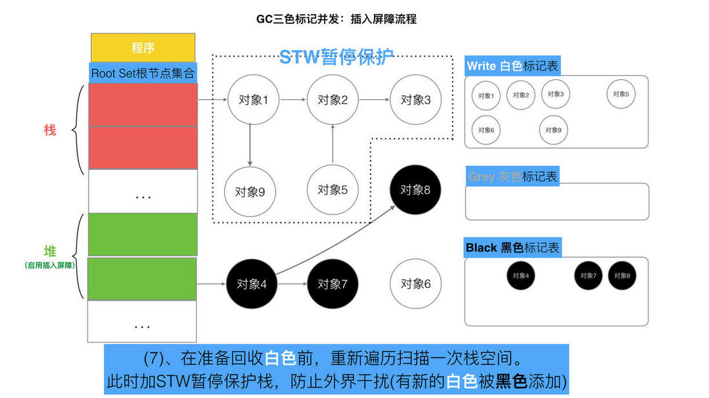

___

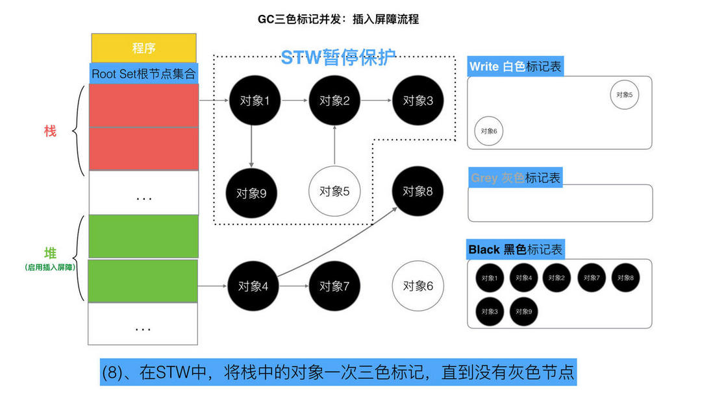

___


___

最后将栈和堆空间 扫描剩余的全部 白色节点清除. 这次STW大约的时间在10~100ms间.

___


___

##### (3) 删除屏障

`具体操作`: 被删除的对象，如果自身为灰色或者白色，那么被标记为灰色。

`满足`: **弱三色不变式**. (保护灰色对象到白色对象的路径不会断)

伪代码：

```
添加下游对象(当前下游对象slot， 新下游对象ptr) {
  
  if (当前下游对象slot是灰色 || 当前下游对象slot是白色) {
          标记灰色(当前下游对象slot)     
  }
  
  
  当前下游对象slot = 新下游对象ptr
}
```

场景：

```
A.添加下游对象(B, nil)   
A.添加下游对象(B, C)         
```

接下来，我们用几张图，来模拟整个一个详细的过程， 希望您能够更可观的看清晰整体流程。

___


___


___

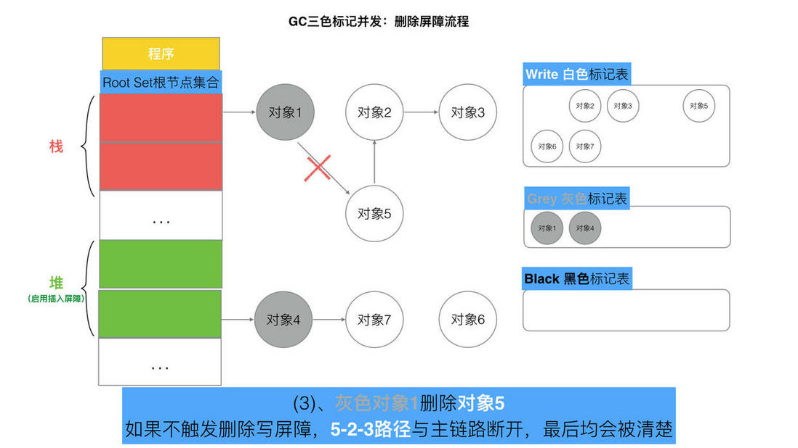

___

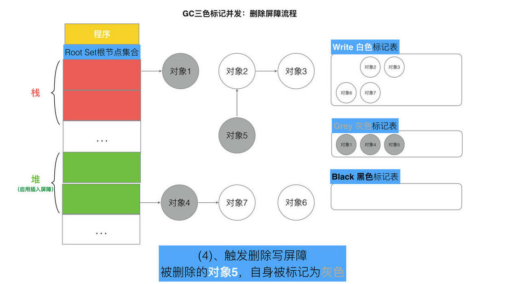

___

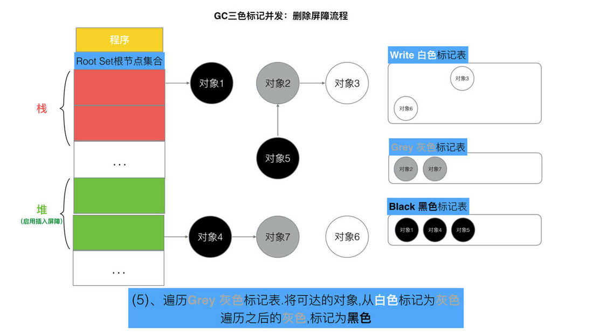

___

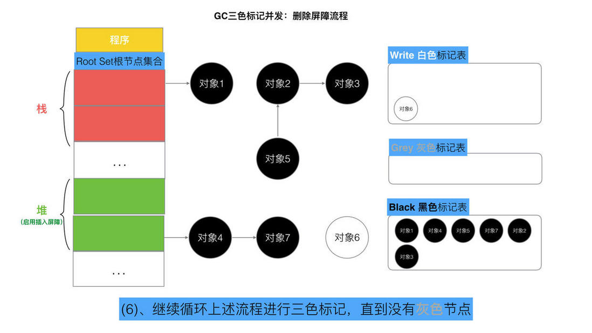

___

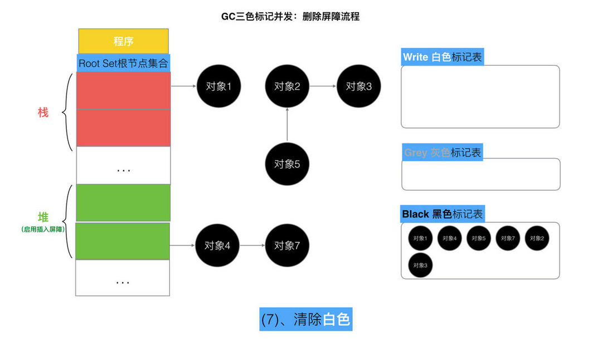

___

这种方式的回收精度低，一个对象即使被删除了最后一个指向它的指针也依旧可以活过这一轮，在下一轮GC中被清理掉。

#### 六、Go V1.8的混合写屏障(hybrid write barrier)机制

插入写屏障和删除写屏障的短板：

-   插入写屏障：结束时需要STW来重新扫描栈，标记栈上引用的白色对象的存活；
-   删除写屏障：回收精度低，GC开始时STW扫描堆栈来记录初始快照，这个过程会保护开始时刻的所有存活对象。

Go V1.8版本引入了混合写屏障机制（hybrid write barrier），避免了对栈re-scan的过程，极大的减少了STW的时间。结合了两者的优点。

___

##### (1) 混合写屏障规则

`具体操作`:

1、GC开始将栈上的对象全部扫描并标记为黑色(之后不再进行第二次重复扫描，无需STW)，

2、GC期间，任何在栈上创建的新对象，均为黑色。

3、被删除的对象标记为灰色。

4、被添加的对象标记为灰色。

`满足`: 变形的**弱三色不变式**.

伪代码：

```
添加下游对象(当前下游对象slot, 新下游对象ptr) {
      
        标记灰色(当前下游对象slot)    
      
      
      标记灰色(新下游对象ptr)
          
      
      当前下游对象slot = 新下游对象ptr
}
```

> 这里我们注意， 屏障技术是不在栈上应用的，因为要保证栈的运行效率。

##### (2) 混合写屏障的具体场景分析

接下来，我们用几张图，来模拟整个一个详细的过程， 希望您能够更可观的看清晰整体流程。

> 注意混合写屏障是Gc的一种屏障机制，所以只是当程序执行GC的时候，才会触发这种机制。

###### GC开始：扫描栈区，将可达对象全部标记为黑

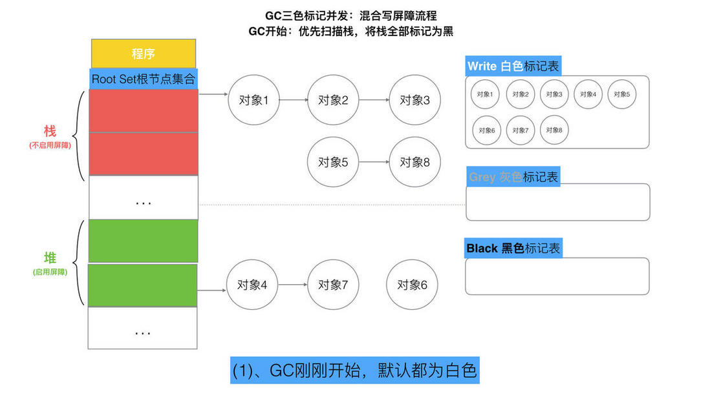

___


___

___

###### 场景一： 对象被一个堆对象删除引用，成为栈对象的下游

> 伪代码

```
栈对象1->对象7 = 堆对象7；  
堆对象4->对象7 = null；    
```


___

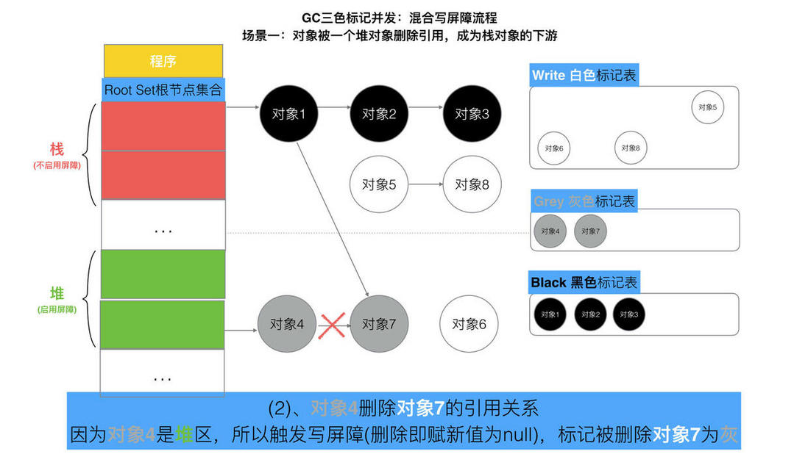

___

###### 场景二： 对象被一个栈对象删除引用，成为另一个栈对象的下游

> 伪代码

```
new 栈对象9；
对象8->对象3 = 对象3；      
对象2->对象3 = null；      
```

___

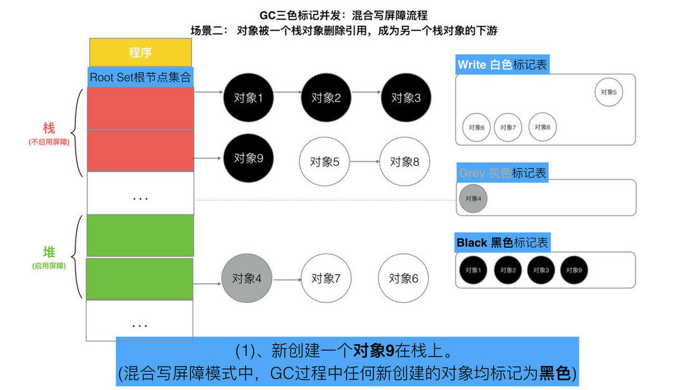

___


___


___

___

###### 场景三：对象被一个堆对象删除引用，成为另一个堆对象的下游

> 伪代码

```
堆对象10->对象7 = 堆对象7；       
堆对象4->对象7 = null；         
```

___

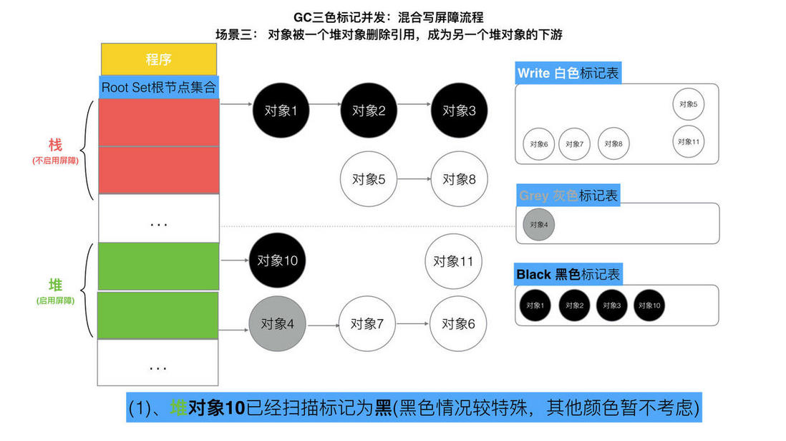

___


___

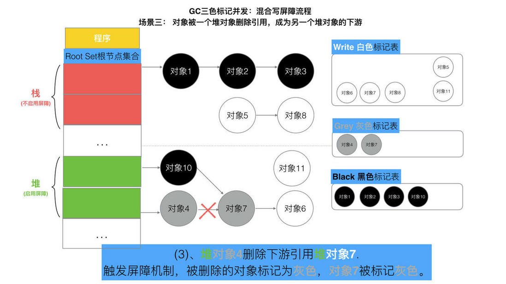

___

___

###### 场景四：对象从一个栈对象删除引用，成为另一个堆对象的下游

> 伪代码

```
堆对象10->对象7 = 堆对象7；       
堆对象4->对象7 = null；         
```

___


___


___


___

___

 Golang中的混合写屏障满足`弱三色不变式`，结合了删除写屏障和插入写屏障的优点，只需要在开始时并发扫描各个goroutine的栈，使其变黑并一直保持，这个过程不需要STW，而标记结束后，因为栈在扫描后始终是黑色的，也无需再进行re-scan操作了，减少了STW的时间。

##### 七、总结

 以上便是Golang的GC全部的标记-清除逻辑及场景演示全过程。

GoV1.3- 普通标记清除法，整体过程需要启动STW，效率极低。

GoV1.5- 三色标记法， 堆空间启动写屏障，栈空间不启动，全部扫描之后，需要重新扫描一次栈(需要STW)，效率普通

GoV1.8-三色标记法，混合写屏障机制， 栈空间不启动，堆空间启动。整个过程几乎不需要STW，效率较高。

参考文献:

[https://www.cnblogs.com/wangyiyang/p/12191591.html](https://link.segmentfault.com/?enc=8gsA3R3eIFoKIr%2B6OUnd%2Fw%3D%3D.qfCKr%2Bcz0qd9EGICmKwrVZYQJ2L4nH4fZMKuFG4bmHQUrNmOZfsKrTtLNQ%2FO2Xw%2Fpo9%2Fcfr%2FP2oFkhGWxQqeRw%3D%3D)  
[https://www.jianshu.com/p/eb6b3aff9ca5](https://link.segmentfault.com/?enc=6%2FZPF8MYMEpuyOK3m1ohPA%3D%3D.DWwt7iB66ygGNK50HV%2F77syhQoTgS6nbU5NmY5v%2BYtOI%2BQEq4j7XG4InqFkniQI7)  
[https://zhuanlan.zhihu.com/p/74853110](https://link.segmentfault.com/?enc=0%2FogihWY1PINvR2EHgb90g%3D%3D.t%2BUKMSWkhtan5kmHbKy9bxWBGpLpw7rClEK6n5EeP%2FAGPh8MLz9NqBNYTxdgWx4j)

___

### 关于作者：

mail: [danbing.at@gmail.com](mailto:danbing.at@gmail.com)  
github: [https://github.com/aceld](https://link.segmentfault.com/?enc=gv%2B8or1haLRz1W%2FtOgtu%2FA%3D%3D.CIzQAL0Ht5i8Snn8LyYJoApExadRqiZGBmvbtaFvynQ%3D)  
原创书籍gitbook: [http://legacy.gitbook.com/@aceld](https://link.segmentfault.com/?enc=j40sxXxb0X%2BIc8Eo06z%2FBQ%3D%3D.FisQRQ83JTzl8OeG6ZL04XKXiIwzHAih3dxE0H2eIze6Mo6PALe93qaXs9NOSuLn)

## 创作不易, 共同学习进步, 欢迎关注作者, 回复"zinx"有好礼


___

## 文章推荐

#### 开源软件作品

[(原创开源)Zinx-基于Golang轻量级服务器并发框架-完整版(附教程视频)](https://link.segmentfault.com/?enc=l%2FJFVLfVug9vmdZR%2F5twMQ%3D%3D.2OiB6pKVi009uQ2i40VkFq9oROZwPGENd4WFR4sg6FKX%2BQLQf05y%2FqZ6Wh7zqQmw)

[(原创开源)Lars-基于C++负载均衡远程调度系统-完整版](https://link.segmentfault.com/?enc=dJP%2B6BRbCQe5Om8m9scp%2FQ%3D%3D.ePNe4Av02JhyrFY7PT%2BmysEzkCl2zJlC3Kw9lh82fBq3xusTV7xFEQdftpMUH%2BWV)

#### 精选文章

[典藏版-Golang调度器GMP原理与调度全分析](https://link.segmentfault.com/?enc=yBgkPOl%2BCnNzGS%2BbrACO1g%3D%3D.IghECZW%2BLPRPyBnZq8ikrL6UVSctHM4oPC5ST6ng947%2BQSD8U5GPOYTlwA5l5Stk)

[最常用的调试 golang 的 bug 以及性能问题的实践方法？](https://link.segmentfault.com/?enc=EP6HfoLUtc4wqvTjMG8NhQ%3D%3D.tUK%2BlwAO5%2BqYeauSPc%2FF%2B7JjDVXKcfvEoHJWMwrsfRthvWPvl0H%2BCkjd0WRKhkAG)

[Golang中的局部变量“何时栈?何时堆?”](https://link.segmentfault.com/?enc=1MHM3ocIZzpGc45hgv%2B4JQ%3D%3D.4dwclyaaPErap%2Be1gqUtihFTd0DDeYT31F%2BcgWUFSZ%2BpMw0y3KH91RzeYW5BbJtB)

[使用Golang的interface接口设计原则](https://link.segmentfault.com/?enc=%2BiiG34r%2BHChwrc8t9kG%2FlA%3D%3D.B895pKc5%2BNTIhjs3xJ%2FR%2BkRy0QUVJMwWouXUgJADPBFJkhHmq7yTALw47ZM5XCU2)

[流？I/O操作？阻塞？epoll?](https://link.segmentfault.com/?enc=UWnQZ5ZnHeEf9jnuho5zFg%3D%3D.q9vcssPmhedk6RzrTFWbESX4l74hFfWtM5tcU5Gg4sCJJioU0n8fJD3wsqk3C2Hi)

[深入浅出Golang的协程池设计](https://link.segmentfault.com/?enc=H2CF1cr9uMVyu2hhaMixUw%3D%3D.7lRuIqu8Soiensuk3E1VDuwR6IkgfO%2F3uTyJbHwASBgHHS6gWv2sinxUw7fG2%2Bdm)

[Go语言构建微服务一站式解决方案](https://link.segmentfault.com/?enc=Mk7jRe%2BTfzFqe5NkaAnEsw%3D%3D.UDr95eKwbs2EA4kPNhH0r5%2FZDSNfc79FoBLGlADc5QlDH%2FupYB5b3TBb4rts2OO1)

___